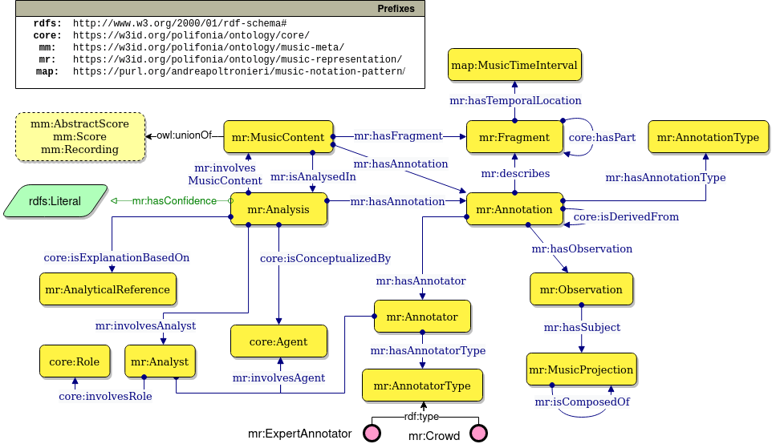
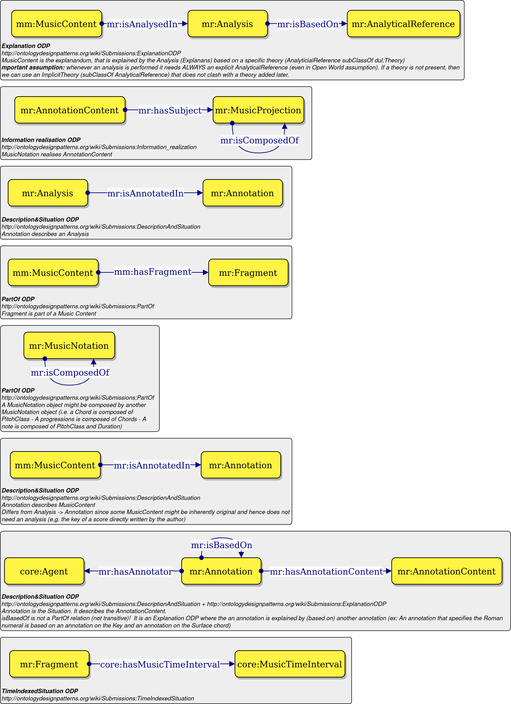

# Music Representation Ontology

An ontology to achieve interoperability of annotation made on musical content.

[](https://zenodo.org/badge/latestdoi/372536364)
[](https://creativecommons.org/licenses/by/4.0/)

> 🔗 Ontology URI: [https://w3id.org/polifonia/ontology/music-representation/](https://w3id.org/polifonia/ontology/music-representation/)

The Music Representation ontology provides a comprehensive schema to describe the analysis of musical objects (a score, an audio track, etc.) interpreted in the context of an existing theory.
Fragments of a musical object -- elements of a musical object whose temporal location is uniquely identifiable -- are described by an annotation provided by an agent, that ranges from an expert annotator to an algorithm.
An annotation is either the subjective result of an analysis (e.g. the chord played in a specific section) or objective (e.g. a note in a digital score).
Each annotation describes some observation (e.g. notes, chords, etc.), whose content we refer to as a musical projection, and can be composed hierarchically.



### Ontology design patterns used
The ontology development reuses estabilished Ontology Design Patterns (ODPs), which can be found at [ontologydesignpatterns.org](ontologydesignpatterns.org/) and are described in the figure below. Each ODP is defined in the PON [core module](https://w3id.org/polifonia/ontology/core/).



## Competency questions addressed
The ontology follows the [eXtreme Design](http://extremedesign.info/) methodology for ontology development. A set of competency questions have been extracted from similar works and are listed below, alongside their provenance.

| ID | Competency question                                                                                       | Reference               |
|----|-----------------------------------------------------------------------------------------------------------|-------------------------|
| 1  | Which are the metrics defining the fragment of the score part?                                            | Music Note Ontology [4] |
| 2  | What is the duration in seconds of a musical object in a given performance?                               | Music Note Ontology [4] |
| 3  | What part of the score does a note belong to?                                                             | Music Note Ontology [4] |
| 4  | What are the dynamic indications referring to a note in the score?                                        | Music Note Ontology [4] |
| 5  | What is the duration in seconds of a note in a given performance?                                         | Music Note Ontology [4] |
| 6  | Which are the accidental of the notes present in a score part?                                            | Music Note Ontology [4] |
| 7  | Which are the fragments of a piece that are of a duration(s) X?                                           | MusicOWL [5]            |
| 8  | Which are the fragments of a piece that use the note(s) X?                                                | MusicOWL [5]            |
| 9  | Which are the fragments of a piece that use the note(s) X with duration(s) Y?                             | MusicOWL [5]            |
| 10 | Which are the compositions containing chords composed of X notes?                                         | MusicOWL [5]            |

## Examples of SPARQL queries

CQ5 - Assuming a performance ?X and a note ?note
```
PREFIX core: <https://w3id.org/polifonia/ontology/core/>
PREFIX core-res: <https://w3id.org/polifonia/resource/core/>
PREFIX mr: <https://w3id.org/polifonia/ontology/music-representation/>

SELECT ?fragment
WHERE { 
  BIND(<Perfomance music entity> as ?X ) .
  BIND(<Note> as ?note ) .
  
  ?annotation mr:describes ?fragment ;
              mr:hasObservation [ mr:hasSubject ?note ] .
    
  ?fragment mr:hasTemporalLocation [
    core:hasMusicTimeDuration [
      core:hasValue ?value ;
      core:hasValueType core-res:seconds
    ]
  ] .

}
```

CQ6 - Assuming a score part staring at ?x and ending at ?y
```
PREFIX core: <https://w3id.org/polifonia/ontology/core/>
PREFIX mr: <https://w3id.org/polifonia/ontology/music-representation/>

SELECT ?subj
WHERE { 
  BIND(<Starting time index> as ?s ) .
  BIND(<Ending time index> as ?y ) .
  
  ?p mr:hasFragment ?fragment .
  
  ?fragment mr:hasTemporalLocation [
    core:hasStartMusicTimeIndex ?x ;
    core:hasEndMusicTimeIndex ?y
  ] .

  ?annotation mr:described ?fragment ;
              mr:hasObservation [ mr:hasSubject ?subj ] .
  ?subj a mp:Accidental .
}
```

CQ7 - Assuming an arbitrary piece ?p and an arbitrary duration ?X
```
PREFIX core: <https://w3id.org/polifonia/ontology/core/>
PREFIX mr: <https://w3id.org/polifonia/ontology/music-representation/>

SELECT ?fragment
WHERE { 
  BIND(<Music piece> as ?p ) .
  BIND(<Target duration> as ?X ) .

  ?p mr:hasFragment ?fragment .
  
  ?fragment mr:hasTemporalLocation [
    core:hasMusicTimeDuration [
      core:hasValue ?X
    ]
  ]
}
```

CQ8 - Assuming an arbitrary piece ?p and an arbitrary note ?note
```
PREFIX core: <https://w3id.org/polifonia/ontology/core/>
PREFIX mr: <https://w3id.org/polifonia/ontology/music-representation/>
PREFIX mp: <https://w3id.org/polifonia/ontology/music-projection/>

SELECT ?fragment
WHERE { 
  BIND(<Music piece> as ?p ) .
  BIND(<Music note> as ?note ) .

  { ?p mr:hasAnnotation ?annotation }
  UNION
  { ?p mr:isAnalysedIn [ mr:hasAnnotation ?annotation ]}

  ?annotation mr:hasObservation [ mr:hasSubject ?note ] ;
              mr:described ?fragment .
}
```

CQ9 - Assuming an arbitrary piece ?p and an arbitrary note ?note with duration ?d.
```
PREFIX core: <https://w3id.org/polifonia/ontology/core/>
PREFIX mr: <https://w3id.org/polifonia/ontology/music-representation/>
PREFIX mp: <https://w3id.org/polifonia/ontology/music-projection/>

SELECT ?fragment
WHERE { 
  BIND(<Music piece> as ?p ) .
  BIND(<Music note> as ?note ) .
  BIND(<Duration> as ?d ) .

  { ?p mr:hasAnnotation ?annotation }
  UNION
  { ?p mr:isAnalysedIn [ mr:hasAnnotation ?annotation ]}

  ?annotation mr:hasObservation [ mr:hasSubject ?note ] ;
              mr:described ?fragment .

  ?fragment mr:hasTemporalLocation [
    core:hasMusicTimeDuration [
      core:hasValue ?d
    ]
  ] .
}
```

CQ10 - Assuming an arbitrary number of notes ?n
```
PREFIX core: <https://w3id.org/polifonia/ontology/core/>
PREFIX mr: <https://w3id.org/polifonia/ontology/music-representation/>
PREFIX mp: <https://w3id.org/polifonia/ontology/music-projection/>

SELECT ?chord
WHERE { 
  BIND(<Music piece> as ?p ) .
  
  { ?p mr:hasAnnotation ?annotation }
  UNION
  { ?p mr:isAnalysedIn [ mr:hasAnnotation ?annotation ] }

  ?annotation mr:hasObservation [ mr:hasSubject ?chord ] .
  ?chord a mp:Chord ;
         mp:isComposedOf ?chordNote .
}
GROUP BY ?chord
HAVING (COUNT(?chordNote) = ?n)
```

## Imported ontologies

### Direct imports
- [Core](https://w3id.org/polifonia/ontology/core)
- [Music Annotation Pattern](https://github.com/andreamust/music-annotation-pattern) [1]
- [SKOS](https://www.w3.org/TR/skos-reference/)

## Aligned ontologies
- JAMS ontology [2]
- Music Note Ontology [3]
- Music Note Ontology [4]
- Music OWL [5]

## Statistics
- number of classes: 78 
- number of object properties: 123
- number of datatype properties: 16
- number of logical axioms: 432

## License

This work is licensed under [Creative Commons Attribution 4.0 International License](http://creativecommons.org/licenses/by/4.0/).


## References

[1] de Berardinis, J., Meroño-Peñuela, A., Poltronieri, A., & Presutti, V. (2022). The Music Annotation Pattern. In V. Svátek, V. A. Carriero, M. Poveda-Villalón, C. Kindermann, & L. Zhou (Eds.), Proceedings of the 13th Workshop on Ontology Design and Patterns (WOP 2022) co-located with the 21th International Semantic Web Conference (ISWC 2022), Online, October 24, 2022 (Vol. 3352)

[2] Andrea Poltronieri, Valentina Presutti, Jacopo de Berardinis, "JAMS Ontology", https://github.com/polifonia-project/jams-ontology

[3] Cherfi, S. S. S., Guillotel, C., Hamdi, F., Rigaux, P., & Travers, N. (2017, December). Ontology-based annotation of music scores. In Proceedings of the Knowledge Capture Conference (pp. 1-4).

[4] Andrea Poltronieri, Aldo Gangemi, (2021) "The Music Note Ontology", WOP 2021 Workshop on Ontology Design and Patterns 2021, co-located with the 20th International Semantic Web Conference (ISWC 2021)

[5] Jones, J., de Siqueira Braga, D., Tertuliano, K., & Kauppinen, T. (2017, August). Musicowl: The music score ontology. In Proceedings of the International Conference on Web Intelligence (pp. 1222-1229).


