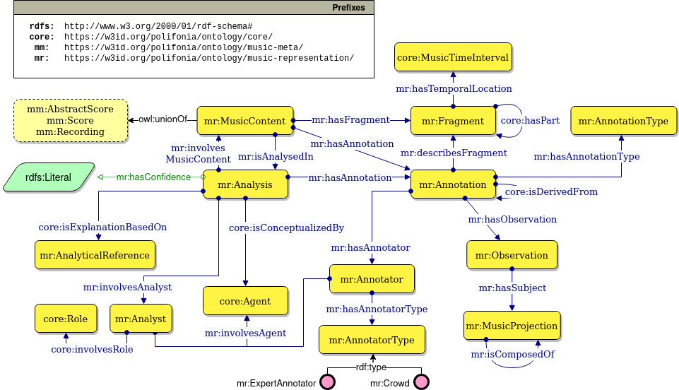

# Music Representation Ontology

The music representation ontology, module of the [Polifonia ontology network](https://github.com/polifonia-project/ontology-network), provides a comprehensive schema to describe the analysis of musical objects (a score, an audio track, etc.) interpreted in the context of an existing theory.
Fragments of a musical object -- elements of a musical object whose temporal location is uniquely identifiable -- are described by an annotation provided by an agent, that ranges from an expert annotator to an algorithm.
An annotation is either the subjective result of an analysis (e.g. the chord played in a specific section) or objective (e.g. a note in a digital score).
Each annotation describes some music content (e.g. notes, chords, etc.), which we refer to as a musical projection, and can be composed hierarchically. 

The ontology re-uses the [Music Annotation Pattern](https://github.com/andreamust/music-annotation-pattern) [1] and is aligned to:
* JAMS ontology [2]
* Music Note Ontology [3] (*the ontology defines domain and range axioms, a modified version that is consistent with this module is provided in ontology/music_note_refactor.owl*)
* Music Note Ontology [4]
* Music OWL [5]

## Design methodology
The ontology follows the [eXtreme Design](http://extremedesign.info/) methodology for ontology development. A set of competency questions have been extracted from similar works and are listed below, alongside their provenance.

| ID | Competency question                                                                                       | Reference               |
|----|-----------------------------------------------------------------------------------------------------------|-------------------------|
| 1  | Which are the metrics defining the fragment of the score part?                                            | Music Note Ontology [4] |
| 2  | What is the duration in seconds of a musical object in a given performance?                               | Music Note Ontology [4] |
| 3  | What part of the score does a note belong to?                                                             | Music Note Ontology [4] |
| 4  | What are the dynamic indications referring to a note in the score?                                        | Music Note Ontology [4] |
| 5  | What is the duration in seconds of a note in a given performance?                                         | Music Note Ontology [4] |
| 6  | Which are the accidental of the notes present in a score part?                                            | Music Note Ontology [4] |
| 7  | Which are the fragments of a piece that are of a duration(s) X?                                           | MusicOWL [5]            |
| 8  | Which are the fragments of a piece that use the note(s) X?                                                | MusicOWL [5]            |
| 9  | Which are the fragments of a piece that use the note(s) X and duration(s) Y?                              | MusicOWL [5]            |
| 10 | Which are the fragments of a piece that use the note(s) X and duration(s) Y distributed over Z measures?  | MusicOWL [5]            |
| 11 | Which are the compositions containing chords composed of X notes?                                         | MusicOWL [5]            |

The ontology development reuses estabilished Ontology Design Patterns, which can be found at [ontologydesignpatterns.org](ontologydesignpatterns.org/) and are described in the figure below.

## References

[1] de Berardinis, J., Meroño-Peñuela, A., Poltronieri, A., & Presutti, V. (2022). The Music Annotation Pattern. In V. Svátek, V. A. Carriero, M. Poveda-Villalón, C. Kindermann, & L. Zhou (Eds.), Proceedings of the 13th Workshop on Ontology Design and Patterns (WOP 2022) co-located with the 21th International Semantic Web Conference (ISWC 2022), Online, October 24, 2022 (Vol. 3352)

[2] Andrea Poltronieri, Valentina Presutti, Jacopo de Berardinis, "JAMS Ontology", https://github.com/polifonia-project/jams-ontology

[3] Cherfi, S. S. S., Guillotel, C., Hamdi, F., Rigaux, P., & Travers, N. (2017, December). Ontology-based annotation of music scores. In Proceedings of the Knowledge Capture Conference (pp. 1-4).

[4] Andrea Poltronieri, Aldo Gangemi, (2021) "The Music Note Ontology", WOP 2021 Workshop on Ontology Design and Patterns 2021, co-located with the 20th International Semantic Web Conference (ISWC 2021)

[5] Jones, J., de Siqueira Braga, D., Tertuliano, K., & Kauppinen, T. (2017, August). Musicowl: The music score ontology. In Proceedings of the International Conference on Web Intelligence (pp. 1222-1229).

## License

This work is licensed under a
[Creative Commons Attribution 4.0 International License][cc-by].

[cc-by]: http://creativecommons.org/licenses/by/4.0/
